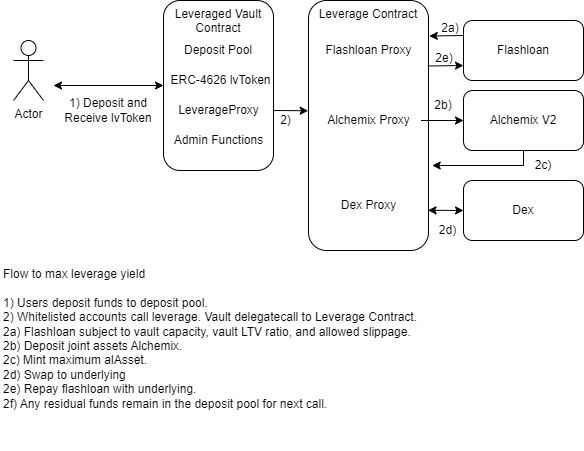

# Alchemix Leveraged Vaults (LogrisV1)

ERC4626-based vault system that enables leveraged positions in Alchemist V3 using flash loans for capital efficiency.

## Table of Contents

- [Overview](#overview)
- [Quick Start](#quick-start)
- [Architecture](#architecture)
- [Installation](#installation)
- [Configuration](#configuration)
- [Testing](#testing)
- [Local Development](#local-development)
- [Project Structure](#project-structure)
- [Documentation](#documentation)
- [Security](#security-considerations)

## Overview

LogrisV1 is a DeFi leverage system that allows users to pool funds and automatically create leveraged positions in Alchemist V3. The system uses flash loans for capital-efficient leverage execution and implements a proportional share distribution mechanism with efficiency bonuses.

**Key Features:**
- ERC4626-compliant tokenized vault for multi-user deposits
- Single vault position shared proportionally by all users
- Flash loan integration (Balancer) for capital efficiency
- Leverage efficiency bonus system rewarding optimal capital use
- NFT-based position management compatible with Alchemist V3

## Quick Start

```bash
# Clone and install
git clone https://github.com/your-org/LogrisV1.git
cd LogrisV1
forge install

# Build
forge build

# Run tests
forge test

# Start local development environment (mainnet fork)
./script/start-local.sh
```

See [Local Testing Guide](docs/local-testing.md) for detailed local development instructions.

## Architecture



### Core Components

| Contract | Purpose |
|----------|---------|
| **LeveragedVault** | ERC4626 vault that pools user deposits and manages a single Alchemist V3 position |
| **AlchemistV3Base** | Base contract for Alchemist V3 interactions (NFT-based positions) |
| **V3Leverager** | Modular leverager coordinating flash loans, swaps, and conversions |
| **FlashLoanAdapters** | Balancer/Aave/Euler adapters behind a unified interface |
| **CurveSwapper / CurvePoolSwapper** | Curve swap integrations for debt repayment |
| **WETHToWstETHConverter** | Underlying ↔ yield token conversion via Curve stETH pool |
| **AlchemixV3DebtAdapter** | Adapter for Alchemist V3 debt token operations |
| **AlchemistV3LeverageCalculator** | Mathematical engine for optimal leverage calculations |
| **ISwapper / ITokenConverter** | DEX/converter interfaces used by the leverager |

### Leverage Flow

```
User → LeveragedVault (ERC4626) → Leverager → Flash Loan Provider
                              ↑         ↓
                              └─ Callback (deposit/mint/withdraw/burn)
```

1. User deposits underlying tokens to the vault
2. Vault converts and holds yield tokens
3. User initiates leverage operation
4. Leverager takes flash loan, converts to yield tokens
5. Leverager calls vault callbacks to deposit and mint debt
6. Leverager swaps debt tokens to repay flash loan
7. User receives shares proportional to their contribution + efficiency bonuses

## Installation

### Prerequisites

- [Foundry](https://book.getfoundry.sh/getting-started/installation) (forge, cast, anvil)
- Git
- Node.js 18+ (for frontend only)

### Dependencies

The project uses the following libraries (managed via `forge install`):

| Library | Purpose |
|---------|---------|
| forge-std | Foundry testing framework |
| openzeppelin-contracts | ERC20, ERC721, access control |
| openzeppelin-contracts-upgradeable | Upgradeable contracts |
| chainlink-brownie-contracts | Price feeds (if needed) |
| alchemix-v3 | Alchemist V3 integration (submodule) |

## Configuration

### Solidity Version

The project uses Solidity 0.8.26 as specified in `foundry.toml`.

### Constructor Parameters

When deploying `LeveragedVault`:

```solidity
LeveragedVault(
    string memory tokenName,              // Vault token name (e.g., "alUSD Leverage Vault")
    string memory tokenDescription,       // Vault token symbol (e.g., "aLV")
    address alchemistV3,                  // Alchemist V3 contract address
    address yieldToken,                   // Yield token (e.g., wstETH)
    address underlyingToken,              // Underlying token (e.g., WETH)
    address leverager,                    // Leverager contract address
    address debtSource,                   // Debt adapter address
    uint32 underlyingSlippageBasisPoints, // Slippage protection (100 = 1%)
    uint32 debtSlippageBasisPoints,       // Slippage protection (300 = 3%)
    address wETH                          // WETH contract address
)
```

### Key Parameters

| Parameter | Default | Description |
|-----------|---------|-------------|
| `underlyingSlippageBasisPoints` | 100 (1%) | Slippage tolerance for underlying token conversions |
| `debtSlippageBasisPoints` | 300 (3%) | Slippage tolerance for debt token swaps |
| Flash Loan Fee | 0% (Balancer V2 default) | Adapter exposes actual fee; Aave V3 varies |
| Max LTV | 90% | Alchemist V3 loan-to-value ratio |
| Max Bonus Cap | 25% | Maximum efficiency bonus on base shares |

## Leverage Efficiency Bonuses

The vault implements a leverage efficiency bonus system that rewards users for efficient capital use:

| Bonus Type | Amount | Description |
|------------|--------|-------------|
| **Flash Loan Bonus** | 5% | Bonus for using flash loans |
| **Leverage Bonus** | 2% per unit | Scales with leverage multiplier |
| **Risk Bonus** | 1% per 10% debt ratio | Reward for taking on debt risk |
| **Max Cap** | 25% of base shares | Total bonus cannot exceed this cap |

## Vault Capacity Scenarios

The leverage contract handles different capacity scenarios:

1. **Full Vault**: Reverts if no capacity available
2. **Deposit Only**: If capacity exists but no leverage headroom, deposits without leverage
3. **Partial Leverage**: If capacity < max leverage, uses available capacity optimally
4. **Full Leverage**: Uses architecture flow shown in diagram for maximum leverage

## Testing

### Run All Tests

```bash
forge test
```

### Run Specific Test Categories

```bash
# Unit tests (mock-based, fast)
forge test --match-path "test/LeveragedVaultTest.t.sol" -vvv
forge test --match-path "test/AlchemistV3LeverageCalculator.t.sol" -vvv
forge test --match-path "test/ERC4626.t.sol" -vvv

# Fork tests (require RPC, slower)
forge test --match-path "test/*Fork.t.sol" --fork-url $ETH_RPC_URL -vvv

# End-to-end tests
forge test --match-path "test/AlchemistV3E2E.t.sol" -vvv
```

### Test Summary

```bash
forge test --summary
```

### Test Coverage

```bash
forge coverage
```

## Local Development

### Start Local Environment

```bash
# Start Anvil fork with all contracts deployed
./script/start-local.sh

# In a new terminal, start the frontend (optional)
cd dapp && ./serve.sh
```

The local environment:
- Forks Ethereum mainnet at block 19,500,000
- Deploys complete AlchemistV3 system
- Deploys Leverager system (flash loans, swapper, leverager)
- Outputs all contract addresses to `dapp/src/contracts.json`

### Test Accounts

Anvil provides pre-funded accounts (10,000 ETH each):

| Account | Private Key |
|---------|-------------|
| 0xf39F...2266 | `0xac0974bec39a17e36ba4a6b4d238ff944bacb478cbed5efcae784d7bf4f2ff80` |
| 0x7099...79C8 | `0x59c6995e998f97a5a0044966f0945389dc9e86dae88c7a8412f4603b6b78690d` |
| 0x3C44...93BC | `0x5de4111afa1a4b94908f83103eb1f1706367c2e68ca870fc3fb9a804cdab365a` |

**Warning:** Never use these keys on mainnet. They are publicly known test keys.

See [Local Testing Guide](docs/local-testing.md) for complete setup instructions.

## Project Structure

```
LogrisV1/
├── src/
│   ├── LeveragedVault.sol              # Main vault contract (ERC4626 + callbacks)
│   ├── LeveragedVaultFactory.sol       # Factory for deploying vaults
│   ├── ERC4626.sol                     # ERC4626 implementation
│   ├── AlchemixV3DebtAdapter.sol       # V3 debt adapter
│   ├── AlchemistV3LeverageCalculator.sol  # Leverage calculation engine
│   ├── BasicAlchemistV3Integrator.sol  # Single-user V3 integration
│   ├── SimpleDebtTokenAdapter.sol      # Simple debt token operations
│   │
│   ├── base/
│   │   ├── AlchemistV3Base.sol         # Base V3 operations
│   │   └── SlippageControl.sol         # Shared slippage controls
│   │
│   ├── adapters/
│   │   ├── CurveSwapper.sol            # Curve DEX integration
│   │   ├── CurvePoolSwapper.sol        # Pool-specific Curve swaps
│   │   ├── WstETHAdapter.sol           # wstETH token adapter
│   │   └── flashloan/
│   │       ├── BalancerFlashLoanAdapter.sol
│   │       ├── AaveV3FlashLoanAdapter.sol
│   │       └── EulerFlashLoanAdapter.sol
│   │
│   ├── converters/
│   │   └── WETHToWstETHConverter.sol   # WETH ↔ wstETH converter
│   │
│   ├── leveragers/
│   │   └── V3Leverager.sol             # Modular V3 leverager
│   │
│   ├── config/
│   │   ├── MainnetAddresses.sol        # Mainnet contract addresses
│   │   └── NetworkConfig.sol           # Per-network config
│   │
│   ├── interfaces/                     # Contract interfaces
│   │   ├── alchemist/                  # Alchemist V3 interfaces
│   │   ├── balancer/                   # Balancer vault interfaces
│   │   ├── curve/                      # Curve pool/router interfaces
│   │   ├── euler/                      # Euler flash loan interfaces
│   │   └── flashloan/                  # Flash loan interfaces
│   │
│   └── test/                           # Solidity test mocks/helpers
│
├── test/
│   ├── LeveragedVaultTest.t.sol        # Main vault tests
│   ├── LeveragedVaultFactory.t.sol     # Factory tests
│   ├── AlchemistV3LeverageCalculator.t.sol  # Calculator tests
│   ├── BasicAlchemistV3Integrator.t.sol     # V3 integration tests
│   ├── AlchemistV3E2E.t.sol            # End-to-end tests
│   ├── CurveSwapperFork.t.sol          # Curve fork tests
│   ├── FlashLoanAdapterFork.t.sol      # Flash loan fork tests
│   ├── IntegrationFork.t.sol           # Integration fork tests
│   ├── EdgeCases.t.sol                 # Edge case tests
│   ├── ERC4626.t.sol                   # ERC4626 compliance tests
│   └── SimpleDebtTokenAdapter.t.sol    # Adapter tests
│
├── script/
│   ├── DeployFork.s.sol                # Mainnet fork deployment script
│   ├── DeployMock.s.sol                # Mock deployment script
│   └── start-local.sh                  # Start local fork environment
│
├── dapp/                               # Frontend application
├── docs/                               # Documentation
├── lib/                                # Dependencies (forge-std, OpenZeppelin, etc.)
└── alchemix-v3/                        # Alchemix V3 submodule
```

## Documentation

| Document | Description |
|----------|-------------|
| [Alchemix V3 Integration](docs/alchemix-v3-integration.md) | V3 integration architecture and callback pattern |
| [Implementation Guide](docs/implementation-guide.md) | Detailed implementation guide with code samples |
| [Local Testing](docs/local-testing.md) | Local environment setup with Anvil fork |

### Archived Documentation

| Document | Description |
|----------|-------------|
| [Development Plan](docs/archive/DEVELOPMENT_PLAN.md) | Development roadmap and progress |
| [Phase 2 Testing Summary](docs/archive/PHASE_2_TESTING_SUMMARY.md) | Testing results and mock architecture |
| [WETH Parameter Changes](docs/archive/WETH_PARAMETER_CHANGES.md) | WETH parameter refactoring details |

## Alchemist V3 vs V2

Key architectural differences:

| Feature | Alchemix V2 | Alchemix V3 |
|---------|-------------|-------------|
| Position model | Account-based (address) | NFT-based (ERC-721) |
| Position ID | User address | Token ID |
| Delegation | Custom approvals | ERC-721 standard + mint approvals |
| LTV | Variable per adapter | Fixed 90% |

See [Alchemix V3 Integration](docs/alchemix-v3-integration.md) for detailed integration guidance.

## Security Considerations

- **Slippage Protection**: All swaps include configurable slippage limits
- **Access Control**: Vault callbacks restricted to authorized leverager only
- **Bonus Caps**: Efficiency bonuses capped at 25% to prevent gaming
- **Flash Loan Safety**: Atomic transactions with proper repayment validation
- **Position Ownership**: Vault owns single Alchemist V3 position, users hold proportional vault shares

## License

MIT
