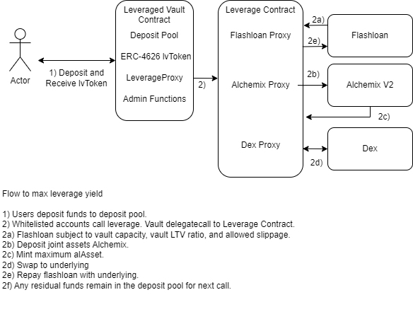

# Alchemix Leveraged Vaults

## Architecture Overview



## Leverage Contract Overview

There are a stacked set of conditions the leverage contract needs to handle based on the vault capacity.

1) In the most basic case, the vault is full and we just revert.

2) If there is capacity for deposits but not for any leverage we just deposit what we can to the vault and exit.

3) If there is more capacity than the initial deposit but less than max leverage we flashloan as much as is necessary to receive the max deposit amount post slippage, mint as much alAsset as possible, swap it all, repay the loan, and any residual sits in the deposit pool.

4) If there is more ample capacity then we use the flow shown in the architecture overview.


# Frontend

Our front end is currently running on a fork on Ethereum so we can whitelist our contracts with the Alchemix ones and utilize the Curve and Euler ecosystems on top of Alchemix. The credentials for this fork is at:
``` RPC URL:  http://45.56.83.209:8885
    ChainID: 0x1
    Token Name: Ethereum
    Token Symbol: Ethereum
```
Please do not use your own wallet to connect to an RPC end point like this as it can be very insecure. Here are several private keys all preloaded with 1000 ETH..

```(0) 0xac0974bec39a17e36ba4a6b4d238ff944bacb478cbed5efcae784d7bf4f2ff80
(1) 0x59c6995e998f97a5a0044966f0945389dc9e86dae88c7a8412f4603b6b78690d
(2) 0x5de4111afa1a4b94908f83103eb1f1706367c2e68ca870fc3fb9a804cdab365a
(3) 0x7c852118294e51e653712a81e05800f419141751be58f605c371e15141b007a6
(4) 0x47e179ec197488593b187f80a00eb0da91f1b9d0b13f8733639f19c30a34926a
(5) 0x8b3a350cf5c34c9194ca85829a2df0ec3153be0318b5e2d3348e872092edffba
(6) 0x92db14e403b83dfe3df233f83dfa3a0d7096f21ca9b0d6d6b8d88b2b4ec1564e
(7) 0x4bbbf85ce3377467afe5d46f804f221813b2bb87f24d81f60f1fcdbf7cbf4356
(8) 0xdbda1821b80551c9d65939329250298aa3472ba22feea921c0cf5d620ea67b97
(9) 0x2a871d0798f97d79848a013d4936a73bf4cc922c825d33c1cf7073dff6d409c6
```

Enter the directory

```cd logrisv1-frontend
```
Install node packages
```npm i
```
Run Development Server
```npm run dev
```

